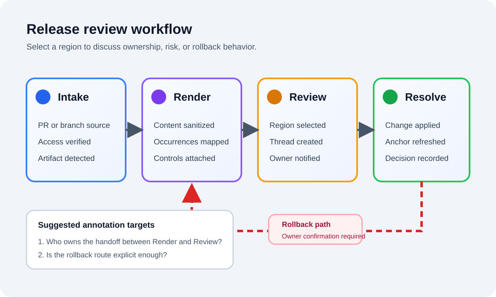
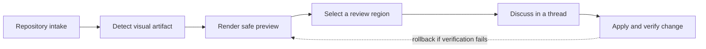

# Enterprise Launch Brief

Commentary turns Markdown pull requests into readable review workspaces so product and engineering teams can discuss real documents instead of scanning a wall of diff lines.

## Updated objective

Launch a public demo that feels like a real operating workspace for cross-functional review. The demo should prove that Commentary can handle long-form planning documents, not just isolated snippets.

## Demo goals

| Measure | Target | Why it matters |
| --- | --- | --- |
| Demo loads without login | Yes | Visitors should get to value immediately. |
| Commenting works after GitHub sign-in | Yes | The demo must prove the real write path. |
| Review shows multiple Markdown files | Yes | The file navigator should feel like a real review. |
| Commit-specific diff navigation is meaningful | Yes | The change-set picker should demonstrate a multi-commit story. |
| Visual regions can be discussed precisely | Yes | Reviewers should identify the exact dashboard panel, diagram node, or rollback path that needs attention. |

## Visual review walkthrough

Activate visual annotation, drag a rectangle around a specific part of an image or diagram, and submit the normal review comment. Use Fit and zoom controls to inspect detail; the underlying artifact remains unchanged.

### Operations dashboard

Annotate the blocked red timeline item, a critical cell in the risk matrix, or the aging panel that needs an explicit owner.

### Source-backed workflow

The SVG remains available in Raw. Try annotating the dashed rollback route or the ownership handoff between Render and Review.

The same source appears again below. A comment on this occurrence should not place a marker on the occurrence above.

### Mermaid lifecycle

Open the same lifecycle as a [standalone Mermaid artifact](../diagrams/release-flow.mmd) to compare its source-backed Raw and Preview surfaces.

## Primary messages

1. The rendered document remains the primary review surface.
2. Comments stay attached to semantic blocks rather than raw diff lines.
3. The GitHub review event is still the final submission mechanism.

## Experience principles

- Keep the first screen calm and document-first.
- Make it obvious that visitors can use the same flow on their own repositories.
- Use realistic product-planning prose so the review feels credible in screenshots and live demos.
- Ensure the supporting docs still expose navigable structural edits across the commit list.

> The sample PR should read like a product workspace that just happens to be public.
